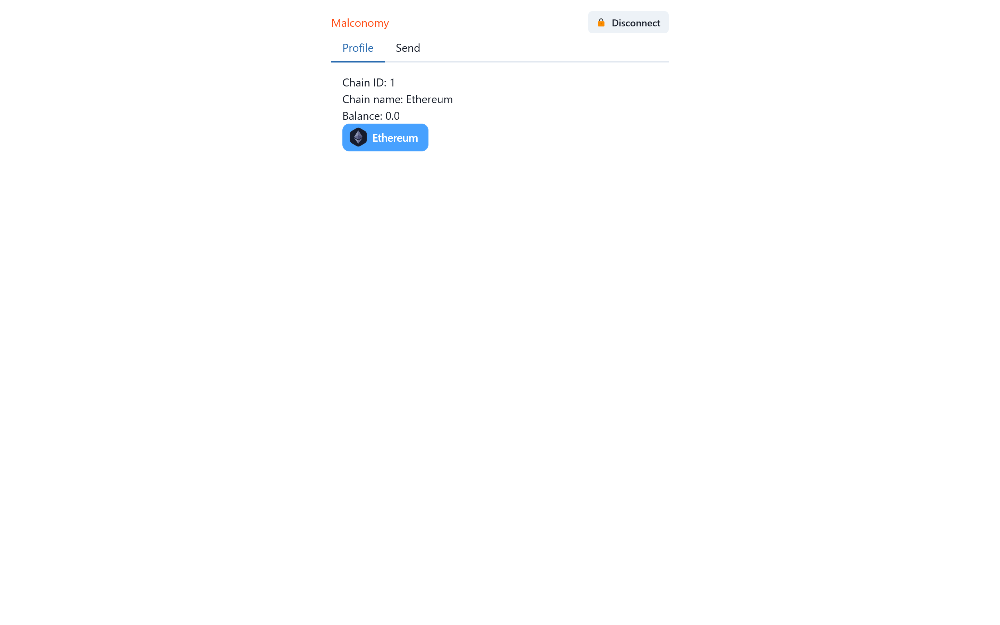

# [malconomy](https://malconomy.vercel.app)

[](https://github.com/prettier/prettier)
[](https://github.com/malcodeman/web3-auth/blob/master/LICENSE)

Simple web3 authentication.



## Getting started

```
git clone https://github.com/malcodeman/web3-auth.git
cd web3-auth
npm install
npm run dev
```

## License

[MIT](./LICENSE)
